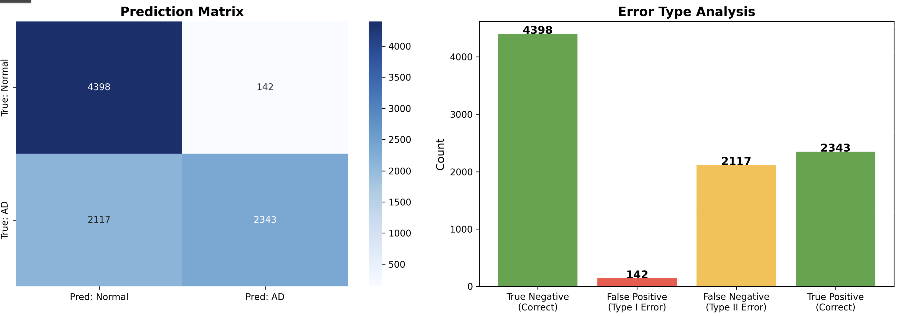

HEYO HEYO :3

Running these command:
    cd recognition/Leyla\ Suljic\ 48912196\ ConvNeXt\ Classify\ Alzheimer’s\ Disease\ Of\ The\ ADNI\ Brain\ Data\ /data
    scp -r s4891219@rangpur.compute.eait.uq.edu.au:/home/groups/comp3710/ADNI .

---------------------------------------------------------------------------------------------------------------------------------------------------------------------------------------------
RUN 1: 

This is sort of a logic dump so on my very first implementation i seemed to get crazy overfitting to the degree that i was getting super high val/training accuracy of like 99% but when it came to the test data i would just underperform majorly. I.e., that my implementation seemed to memorise training data but had failed on real data.

Plus based on my results from analysis it seemed to be an issue where I was overpredicting the number of normals (referred to as a type 2 errors so lots of false negatives); I was over predicting the amount of normal MRI results despite the fact they were all AD. This was the overwhelming source of error in my implementation.

My idea here is to increase the weighting for more significant focus on the AD (heavier penalty if i mistake the AD) and to have an increased no. of epochs as well as to increase my dropout (I am trying to fix my val accuracy vs test accuracy discrepancy).
---------------------------------------------------------------------------------------------------------------------------------------------------------------------------------------------
RUN 2: