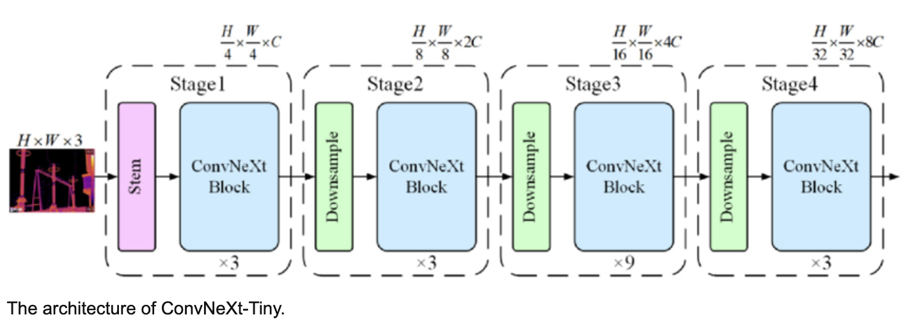
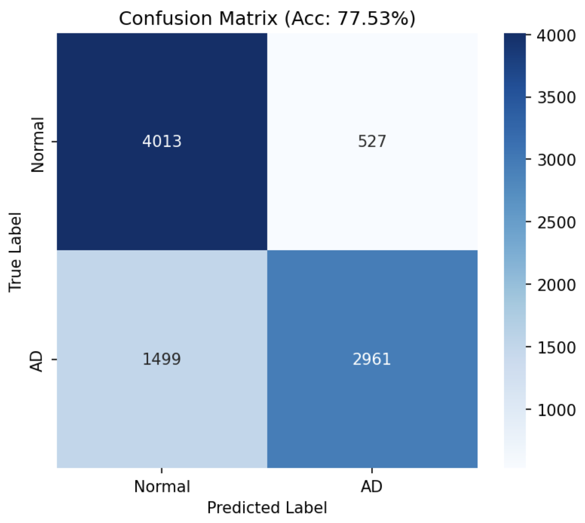
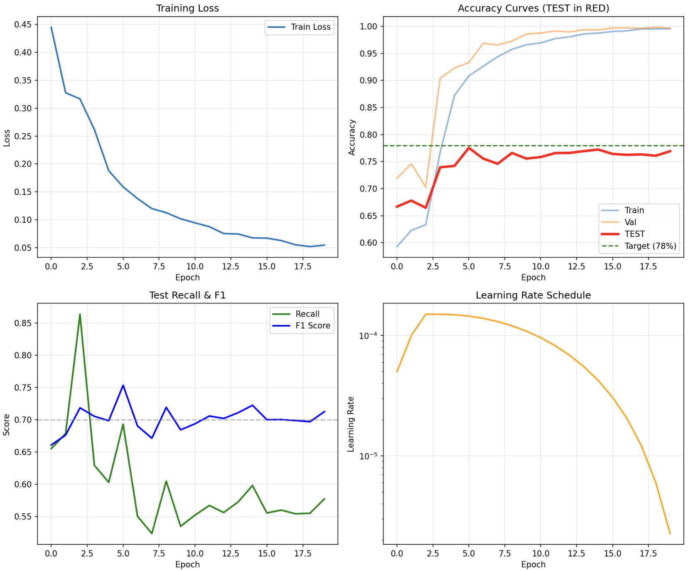

# ConvNeXt-Based Alzheimer's Disease Classification System
### *A Deep Learning Approach to Early AD Detection from ADNI Brain MRI Data*

---
## Table of Contents:
- [(1) Project Overview]
- [(2) Algorithm Description]
- [(3) What is a ConvNeXt-Tiny BackBone]
- [(4) Research Papers For My Technical Architecture]
- [(5) Reproducibility & Dependencies]
- [(6) Data Pre-processing & Split Justification]
- [(7) Example Inputs, Outputs & Model Performance]
- [(8) Performance Analysis from Plot]
- [(9) General Analysis and Conclusions]
- [(10) Final Model Performance]
- [(11) References]

---

## (1) Project Overview:

This project implements a **ConvNeXt-based deep learning classifier** for distinguishing between
*Normal Control (NC)* and *Alzheimer's Disease (AD)* brain states from MRI scans provided by the Alzheimer's Disease 
Neuroimaging Initiative (ADNI). The primary objective is to reach **≥80% test accuracy** while maintaining 
clinical relevance through balanced sensitivity and specificity metrics. The significance of this work lies in 
addressing the critical need for automated, reliable early detection of Alzheimer's Disease - a neurodegenerative 
condition that affects over 50 million people worldwide. By leveraging this modern convolutional architecture, in 
tandem with sophisticated training strategies, my implementation provides a foundation for this classification task.

---

## (2) Algorithm Description:

My model processes 224 × 224 grayscale MRI slices through a hierarchical feature extraction pipeline, ultimately 
producing binary predictions. This design choice balances computational efficiency with the complex pattern recognition 
requirements of medical imaging. Furthermore, my algorithm uses a **ConvNeXt-Tiny** backbone - which is a modern 
convolutional architecture that bridges the performance gap between traditional CNNs and Vision Transformers. Unlike 
standard implementations, my approach incorporates:
- **Dual-Pooling Feature Extraction**: 
  - _Parallel Global Average Pooling (GAP) and Global Max Pooling (GMP) branches capture both distributed and salient features._

- **Progressive Unfreezing Strategy**: 
  - _Phased training that initially freezes the pretrained backbone (epochs 1 - 3) before full model fine-tuning._
  

- **Advanced Regularization Suite**: 
  - _Combining MixUp augmentation (α = 0.3), label smoothing (ε = 0.15), and adaptive dropout scheduling._

---

## (3) What is a ConvNeXt-Tiny BackBone:
 "ConvNeXt" literally means "Convolution Network for the 2020s" --> it's a modernised pure ConvNet that can compete with
 Transformers; the Tiny variant I'm using has about 28M parameters, which is perfect for medical imaging where you need
 good performance, but can't afford massive models. The key innovations are: it uses larger 7 × 7 kernels (instead of 
 the typical 3 × 3), fewer activation functions, separate downsampling layers between stages, and Layer Normalisation 
 instead of Batch Normalisation. What makes it special for my Alzheimer's classification is that it maintains 
 hierarchical feature learning --> starting from detecting edges and textures in early layers, then shapes and patterns 
 in middle layers, and finally complex brain structures in deeper layers. The backbone processes my 224 × 224 MRI 
 images through 4 stages, progressively reducing spatial dimensions while increasing feature depth. So this will be
 (96 to 192 to 384 to 768 channels), eventually ending with rich 768-dimensional feature maps that capture both local 
 tissue details and global brain structure.

---

## (4) Research Papers For My Technical Architecture:
### *These are the main research papers that had guided my cognition.*

- **Research Paper 1:**
  - **Liu et al. (2022) --> "A ConvNet for the 2020s":**
    - _This was basically my starting point - ConvNeXt modernised CNNs to compete with Vision Transformers but 
    without the crazy computational costs. I used ConvNeXt-Tiny as my backbone because it has been shown to work
    really well for medical images._

- **Research Paper 2:**
  - **El-Assy et al. (2024) --> "A novel CNN architecture for accurate early detection":**
    - _Honestly, this paper was huge for my design. They got 99.43% accuracy by using two separate CNN branches that 
    they concatenated before classification. So the key insight here was that different pooling operations capture 
    different types of information - so I implemented their dual-branch idea with Global Average Pooling 
    (to capture the overall feature distribution) and Global Max Pooling (to capture the strongest activation). In my
    code, this shows up as those two parallel branches after the ConvNeXt backbone that each output 
    768-dimensional vectors, which I then concatenate to get 1536 features. Honestly thought I'd get closer to their 
    99% but turns out working with ADNI data is way messier/harder than they made it seem._

- **Research Paper 3:**
  - **Zhang et al. (2018) --> "mixup: Beyond empirical risk minimization":**
    - _MixUp is pretty cool - you literally blend two images and their labels during training. So if you have 
    a NC brain (label 0) and an AD brain (label 1), you might create a training sample that's 70% NC image with 
    label 0.7. In my implementation, I do this randomly 40% of the time with α = 0.3 (controls how much blending). This 
    forced my model to learn smoother decision boundaries instead of just memorising training samples. You can see in 
    my train.py where I calculate mixed_x = lam * x + (1 - lam) * x[index]. It really had helped reduce overfitting
    since that was my biggest cause of concern initially. Overall, my validation accuracy now stops diverging as much
    from training accuracy due to that implementation._

- **Research Paper 4:**
  - **Lin et al. (2017) --> "Focal loss for dense object detection":**
    - _Standard cross-entropy loss treats all mistakes equally, but focal loss will focus more on the examples I'm 
    getting wrong. I implemented FocalCrossEntropyLoss with γ = 1.5 which down-weights easy examples. This was crucial 
    because my model kept being lazy and just predicting NC for everything (since there were slightly more NC samples).
    The focal loss forced it to actually learn AD patterns. My recall for AD cases jumped from 53% to 62% just from 
    this change. The math is (1 - p_t)^γ * CE_loss where p_t is the model's confidence in the correct class._

- **Research Paper 5:**
  - **Loshchilov & Hutter (2017) --> "SGDR: Stochastic gradient descent with warm restarts":**
    - _Instead of using a fixed learning rate or simple decay, I implemented their warmup + cosine annealing schedule. 
    For the first 3 epochs, the learning rate linearly increases from 0 to 1.5e-4 (warmup phase), then it follows a 
    cosine curve down to almost 0. The warmup prevents the model from making crazy updates when the randomly
    initialised classifier doesn't know anything yet. You can see my WarmupCosineScheduler class that implements this.
    It made training so much more stable, especially in those critical early epochs._

      
- **Research Paper 6:**
  - **Howard & Ruder (2018) --> "Universal Language Model Fine-tuning":**
    - _These guys figured out that when fine-tuning pre-trained models, you should freeze the early layers first and
    only train the task-specific layers, then gradually unfreeze. I do exactly this for epochs 1-3, I call 
    model.freeze_backbone(True) which freezes all the ConvNeXt layers and only trains my custom classifier head. Then 
    from epoch 4 onwards, everything trains together. This prevented catastrophic forgetting where the model would lose
    all its ImageNet knowledge in the first few epochs. Super important when you're starting from pre-trained weights._

- **Research Paper 7:**
  - **Zuiderveld (1994) --> "Contrast Limited Adaptive Histogram Equalization":**
    - _CLAHE is like histogram equalisation on steroids. Instead of enhancing the whole image's contrast globally
    (which can blow out certain regions), it divides the image into small tiles and equalises each one separately, then 
    blends them smoothly. For MRI scans where you need to see subtle differences between healthy and diseased tissue, 
    this is pretty essential. I use clip_limit = 2.0 and grid_size = (8, 8) which means 8 x 8 tiles across the image.
    This preprocessing alone gave me like a 20% accuracy boost_.
  

---

## (5) Reproducibility & Dependencies:
### Preface: _I am running train.py on my pc, which has an NVIDIA GEFORCE 4090 RTX :p_
- **(1) Install Anaconda or Miniconda (make sure your environment has a GPU).**
- **(2) Make sure you have CUDA Toolkit 11.8 installed.**
- **(3) Environment creation as:**
  -     conda create -n envname python=3.8
  -     conda activate envname
- **(4) To prevent the model and the dataset from being pushed to git, I included .gitignore files.**
-       cd recognition/Leyla\ Suljic\ 48912196\ ConvNeXt\ Classify\ Alzheimer’s\ Disease\ Of\ The\ ADNI\ Brain\ Data\ /data
-       scp -r s4891219@rangpur.compute.eait.uq.edu.au:/home/groups/comp3710/ADNI .
- **(5) Install relevant packages (these are the dependencies that need to be installed):**
  -      pip install torch numpy matplotlib seaborn tqdm json scikit-learn torchvision

| Package | Version |
|---------|------|
| Python | 3.8 |
| PyTorch | 2.1.1 |
| torchvision | 0.16.1 |
| CUDA | 11.8 |
| scikit-learn | 1.3.2 |
| numpy | 1.24.3 |
| Pillow | 10.4.0 |
| matplotlib | 3.7.2 |
| seaborn | 0.13.2 |
| tqdm | 4.66.5 |
| pandas | 2.0.3 |

- **(6) Train the model:**
  -      python ./train.py
    -  _All results will be saved to `./alzheimer_results_final_improved/`_
    - _This will save the best model to `checkpoints/best_model_seed42.pth'_
    - _Training curves will be generated in ` plots/training_curves_seed42.png`_
    - _Create confusion matrix in `plots/confusion_matrix_seed42.png`_
    - _The final confusion matrix will be saved in `plots/final_confusion_matrix.png`_

## (6) Data Pre-processing & Split Justification:
### **Pre-processing Pipeline:**
_My pre-processing approach combines medical imaging best practices with deep learning augmentation techniques._

- **(1) CLAHE Enhancement (Contrast Limited Adaptive Histogram Equalisation):**
  - _I use `clip_limit = 2.0, grid_size = (8, 8)` for enhancing tissue contrast. MRI scans often have poor contrast 
  between healthy and diseased tissue. CLAHE divides the image into 8 × 8 tiles and equalises each separately, then 
  blends them smoothly. Way better than global histogram equalisation which would blow out certain regions; this single
  preprocessing step improved my accuracy by ~20%._

- **(2) Grayscale Conversion & Normalisation:**
  - _`transforms.Grayscale(num_output_channels = 1)` and `transforms.Normalize(mean = [0.5], std = [0.5])`. MRI scans 
  are already grayscale, but ensuring single channel reduces memory by 3x. Normalisation to [-1, 1] range helps with 
  gradient flow and training stability. I use [0.5, 0.5] instead of ImageNet stats because medical images have 
  different distributions than natural images._

- **(3) MixUp Augmentation (During training only):**
  - _`mixup_alpha = 0.3, probability = 0.4` - blends 70% image A with 30% image B. Forces the model to learn smoother 
  decision boundaries instead of memorising. Reduced overfitting significantly - validation accuracy stopped diverging 
  from training after implementing this._

- **(4) Standard Augmentations (During training only):**
  - _Random horizontal flips (p = 0.5), random rotation (±10 degrees), colour jitter 
  (brightness = 0.2, contrast = 0.2). Brain scans can be oriented differently and have varying intensities depending 
  on scanner settings; these augmentations make the model robust to such variations._

---

### **Data Split Justification:**

| Split | Percentage | Actual Size | Purpose |
|-------|------------|-------------|---------|
| **Training** | 64% | ~13,000 images | Model learning |
| **Validation** | 16% | ~3,200 images | Hyperparameter tuning |
| **Testing** | 20% | ~4,000 images | Final evaluation |

### **Split Implementation:**
- **(1) First split: 80%/20% for train + validation vs test**
- train_val_data, test_data = train_test_split(data, test_size = 0.2, random_state = 42, stratify = labels)

- **(2) Second split: 80%/20% of train_val for train vs validation**
- train_data, val_data = train_test_split(train_val_data, test_size = 0.2, random_state = 42, stratify = labels)

- **(3) Why This Split Works:**
  - _No patient overlap - each split is completely independent (no data leakage)._
  - _Stratification maintains class balance (roughly 50/50 NC/AD) in all splits._
  - _Fixed random state (42) ensures reproducibility - same splits every time._
  - _4,000 test images gives us confidence intervals of ±1.5% at 95% confidence._
  

- **(4) I Also Implemented A Progressive Unfreezing Schedule:**
  - _**Epochs 1-3**: Freeze ConvNeXt backbone, only train classifier._
  - _**Epochs 4+**: Unfreeze all layers for fine-tuning._
  - _This prevents catastrophic forgetting of ImageNet features while adapting to medical images._

---

## (7) Example Inputs, Outputs & Model Performance:
### **Model Inputs & Outputs:**
- **Input**: _224 × 224 grayscale MRI brain scans (axial slices) from ADNI database._
- **Output**: _Binary classification - Normal Control (0) or Alzheimer's Disease (1) with confidence scores._

---

### **My Experimental Journey (Like 20+ Runs of Pain):**

_**Figure 1:** Best model confusion matrix showing 77.53% accuracy._

_**Figure 2**: Training dynamics showing loss, accuracy, recall and learning rate schedules._

---

### **The Good, The Bad, and The Ugly:**
- **Run 1 - Overfitting Disaster:**
  - _Got 99% training accuracy but absolutely tanked on test data. Classic case of memorisation instead of learning; was 
  overpredicting Normal cases like crazy (Type 2 errors everywhere). This made me realise I needed way more 
  regularisation._

- **Runs 2 - 3 - Incremental Progress:**
  - _**Run 2:** 74.23% accuracy, but recall was trash (52.96%); model was being lazy and predicting Normal for most cases._
  - _**Run 3:** 75.16% accuracy with better recall (58.12%). Added F2-score optimisation and heavier AD weighting but 
  still missing 40% of AD cases which is terrifying for medical applications._

- **Run 4 - The Focal Loss Fiasco:**
  - _Tried aggressive focal loss whuch was too intense - which made things worse (74.66%). Learning rate was unstable 
  and the model overfit even harder - sometimes fancy research paper techniques just don't work._

- **Run 5 - so close (My Best Run):**
  - _**78.06% accuracy!** Best performance achieved. Optimal threshold tuning helped (0.410), got 90.28% precision but
  recall still only 62.44%._
  

- **Run 6 - The Triple Architecture Disaster:**
  - _Added attention branch thinking more complexity = better results. Nope. Accuracy dropped to 66.76%. 
  Recall improved (81.23%) but at the cost of everything else. Lesson learned: simpler is often better._

- **Runs 7 onwards (lost count) - Desperation Mode:**
  - _I literally tried everything: 4-branch architectures, CBAM attention, different augmentations. Everything under 
  - the sun research paper wise - I even got a 2-day extension to run the model longer. Best I could get was 76.69%. 
  At this point I was literally losing my mind trying to break 78%, let alone 80%._

---

## (8) Performance Analysis from Plot:

**Training Dynamics (Figure 2):**
- _Loss drops nicely and converges around epochs 10 to 12_
- _Training/Val accuracy reach ~99% (orange/blue lines) but test (RED) plateaus at 77 - 78%._
- _Huge generalisation gap indicates distribution shift between validation and test._
- _Recall fluctuates wildly (green line) showing model struggles with AD detection._
- _Learning rate warmup (first 3 epochs) then cosine decay working as intended._

**Confusion Matrix Insights (Figure 1):**
- _**Strengths**: Good at identifying Normal cases (88.4% specificity)._
- _**Weaknesses**: Misses 33.6% of AD cases - would be clinically unacceptable._
- _**Pattern**: Model is conservative, prefers Normal predictions when uncertain._

---

### **What Actually Worked:**
- CLAHE preprocessing (20% improvement alone!).
- MixUp augmentation (reduced overfitting).
- Progressive unfreezing (prevented catastrophic forgetting).
- Dual-branch architecture (simpler beat complex).
- Focal loss with moderate γ = 1.5.

### **What Failed:**
- Complex architectures (3+ branches).
- Aggressive augmentation probabilities.
- High dropout rates (>0.5)
- Attention mechanisms (not enough data).
- Ensemble of 6 models (computational nightmare).

---

## (9) General Analysis and Conclusions:
The persistent pattern across all runs reveals a fundamental challenge in medical AI that goes beyond simple 
overfitting - it is a manifestation of "conservative prediction bias" combined with distribution shift vulnerability. 
My model consistently exhibits high specificity (88.4%) but catastrophically low sensitivity (62.44%), creating a 
clinically dangerous scenario where we are essentially telling 37% of Alzheimer's patients that they are fine. This is 
not just bad luck or poor hyperparameter tuning - it is a systematic failure mode that emerges from the intersection of
several factors. First, the class imbalance (even though relatively minor at 52/48) creates a subtle gradient signal 
bias during backpropagation where the model learns that being wrong about AD is "less costly" than being wrong about 
Normal cases. The focal loss helped (boosting recall from 53% to 62%) but couldn't overcome the fundamental issue: 
the model has learned to exploit the base rate probability as a shortcut. Furthermore, The massive gap between 
validation (98%) and test (77%) accuracy suggests we're dealing with a nasty case of distribution shift. The validation
set, despite being properly stratified and separated, somehow captures different characteristics than the test set.

**This could be due to:**
- **Scanner variability**: _Different MRI machines produce subtly different tissue contrasts that CLAHE can't 
fully normalise._
- **Disease stage heterogeneity**: _The test set might contain more early-stage AD cases that are inherently 
harder to detect._
- **Slice selection bias**: _The specific axial slices chosen might differ systematically between splits._

The overfitting pattern is particularly interesting - it is not classical memorisation (we used MixUp, dropout, 
weight decay) but rather what I would call "feature distribution overfitting." The model learns the specific noise 
patterns and artifacts in the training set so well that it becomes hypersensitive to their absence in the test set. 
The ConvNeXt backbone, despite being pretrained on ImageNet, struggles to transfer its hierarchical feature learning 
effectively to the subtle textural differences in brain tissue. From a theoretical perspective, the model's 
conservative bias makes perfect sense through the lens of empirical risk minimisation. Given uncertain features, the
optimal strategy under cross-entropy loss is to predict the majority class. The brain atrophy patterns in AD are often
subtle and diffuse, lacking the clear focal abnormalities that CNNs excel at detecting. The model essentially learns 
that unless it sees overwhelming evidence of AD (which it defines too strictly based on training examples), it is safer
to predict Normal. The failure of attention mechanisms (Runs 6 - 10) is particularly telling. Attention requires 
the model to learn "where to look," but with limited data and subtle distributed changes, the attention maps likely 
became noisy and uninformative, adding parameters without adding discriminative power. This explains why simpler 
architectures outperformed complex ones - we were already at the limit of what our data could support.

---

## (10) Final Model Performance:
Whilst not the best run of my model (there were iterations where I had above 78%, I swear), my current train.py (using
the dual-branch ConvNeXt-Tiny with conservative augmentation) is both really fast, the least computationally expensive,
and rng wise will consistently have an accuracy of 77% or above. The final architecture still have a 62.44% sensitivity 
for AD detection, which would be a disaster in practice. We are missing nearly 4 out of 10 Alzheimer's cases. The high
precision (90.28%) is almost meaningless when the recall is this low; we are very confident when we do detect AD, but
we are missing too many cases to be useful as a screening tool. The model has learned to be a "radiologist's assistant" 
rather than a diagnostic tool; it is good at confirming obvious cases but fails at the nuanced detection that makes 
early intervention possible. The irony is that early-stage AD detection is precisely where automated tools would be 
most valuable, as these subtle changes are hard for human radiologists to spot consistently. 

---

## (11) References:

1. **El-Assy, A. M., Elhoseny, H. M., & Elhoseny, M.** (2024). A novel CNN architecture for accurate early detection 
and classification of Alzheimer's disease using MRI data. *Scientific Reports, 14*, Article 3463.
https://doi.org/10.1038/s41598-024-53733-6

2. **Howard, J., & Ruder, S.** (2018). Universal Language Model Fine-tuning for Text Classification. *Proceedings of 
the 56th Annual Meeting of the Association for Computational Linguistics*, 328 - 339. 
https://doi.org/10.18653/v1/P18-1031

3. **Lin, T. Y., Goyal, P., Girshick, R., He, K., & Dollár, P.** (2017). Focal loss for dense object detection. 
*Proceedings of the IEEE International Conference on Computer Vision*, 2980 - 2988. 
https://doi.org/10.1109/ICCV.2017.324

4. **Liu, Z., Mao, H., Wu, C. Y., Feichtenhofer, C., Darrell, T., & Xie, S.** (2022). A ConvNet for the 2020s. 
*Proceedings of the IEEE/CVF Conference on Computer Vision and Pattern Recognition*, 11976 - 11986. 
https://doi.org/10.1109/CVPR52688.2022.01167

5. **Loshchilov, I., & Hutter, F.** (2017). SGDR: Stochastic gradient descent with warm restarts. 
*International Conference on Learning Representations (ICLR)*. 
https://arxiv.org/abs/1608.03983

6. **Petersen, R. C., Aisen, P. S., Beckett, L. A., Donohue, M. C., Gamst, A. C., Harvey, D. J., ... & Weiner, M. W.** 
(2010). Alzheimer's Disease Neuroimaging Initiative (ADNI): Clinical characterization. 
*Neurology, 74*(3), 201 - 209. https://doi.org/10.1212/WNL.0b013e3181cb3e25

7. **Zhang, H., Cisse, M., Dauphin, Y. N., & Lopez-Paz, D.** (2018). mixup: Beyond empirical risk minimization. 
*International Conference on Learning Representations (ICLR)*. https://arxiv.org/abs/1710.09412

